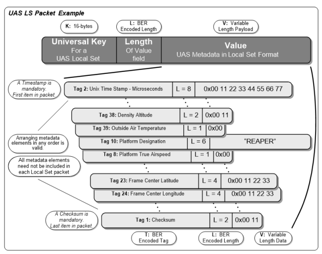
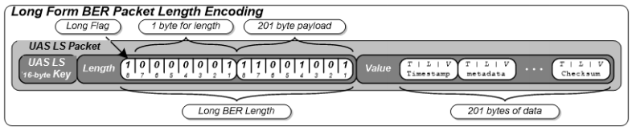

# Introduction

This sample application was constructed an exercise to understand how video data streams can be sent an UAV quadcopter camera to a web browser. This [page](http://impleotv.com/2017/02/17/klv-encoded-metadata-in-stanag-4609-streams/) provides a good primer on [KLV](https://en.wikipedia.org/wiki/KLV) encoded data in [STANAG 4609](http://www.gwg.nga.mil/misb/docs/nato_docs/STANAG_4609_Ed3.pdf).

Once we can read incoming metadata in the browser, we can do interesting things such as displaying our UAV in [Cesium](https://github.com/AnalyticalGraphicsInc/cesium), which is a JavaScript library for creating WebGL globes and time-dynamic content (i.e, a flying quadcopter!)

In order for this to be compelling we need to minimize video latency from the video source to the browser.  The [JSMpeg](https://github.com/phoboslab/jsmpeg) project does a lot of the heavy lifting for getting the mpeg transport stream to the client, and rendering the video (and mp2 audio if present). We extend this project by adding a KLV decoder, and a simple rendering of the decoded data as JSON.

TL;DR jump to the [demo videos](#demoarea).

# Quick start

You need Node.js 22 or newer and FFmpeg on your PATH. From the repository root:

```bash
cd app
npm ci
npm run demo
```

Open the URL printed in the terminal (normally http://127.0.0.1:8085). This starts a moving test pattern, synthetic flight telemetry, the relay, and the viewer. Ctrl-C stops them together. No camera, map token, or Internet connection is needed after installation: the default globe uses the low-resolution imagery bundled with Cesium.

To use a camera instead:

```bash
STREAM_URL='rtsp://your-camera/path' npm run dev
```

The camera must include a KLV data stream. The launcher maps the first video and first data stream, converts the video to MPEG-1, and copies the metadata. It fails if the data stream is missing, rather than silently showing video without telemetry. `./start.sh --demo` and `STREAM_URL=... ./start.sh` are equivalent shortcuts from the repository root on macOS/Linux; the npm commands also work on Windows (set environment variables using your shell's syntax).

The walkthrough and flight notes below are from the original experiment. They explain why the project exists. The current setup uses modern Node tooling, native BigInt, and Cesium from npm; the original video/metadata/3D-view architecture is the same.

# Setup

JSMpeg comes with a websocket server, that accepts a mpeg-ts source and serves it via ws to all connecting browsers. JSMpeg then reads this transport stream passing it as a source to the demuxer, which in turn passes it to the decoder.

We also have a small Node webserver to serve the built assets from `app/www`. It binds to localhost by default. Map and terrain providers are accessed directly from the browser and need to support CORS. Nginx or any other static webserver could easily be used instead; the old general-purpose HTTP proxy has been removed.

To establish a stream from the camera to the websocket server, we [map](https://trac.ffmpeg.org/wiki/Map) our video and data feeds. Since JSMpeg only supports playback of mpeg1, we need to be explicit in our codec choice as well.

```bash
ffmpeg -i rtsp://{camera_source_url} -map 0:v:0 -map 0:d:0 -f mpegts -c:v mpeg1video -c:d copy -b:v 800k -r 25 -s 800x600 -bf 0 http://127.0.0.1:8081/secretkey
```

As noted in the JSMpeg [docs](https://github.com/phoboslab/jsmpeg/blob/master/src/jsmpeg.js), the [player](app/src/jsmpeg/player.js) sets up the connections between the source, demuxer, decoders, and renderer. In order to extend JSMpeg to accept a data stream we subscribe the demuxer to the correct stream identifier (per the STANAG spec it is _0xBD_), implement the decoder, and then send the resultant data to the renderer.

```javascript
var data = new JSMpeg.Decoder.Metadata({streaming: true});
this.demuxer.connect(JSMpeg.Demuxer.TS.STREAM.PRIVATE_1, data);
var klvOut = new JSMpeg.DataOutput.KLV({klvelement: document.getElementById('klv-output')});
data.connect(klvOut);
```
# Details
### Decoder
The decoder is implemented by [metadata.js](app/src/jsmpeg/metadata.js). The basic flow of control is to look for the 16-byte universal UAS LDS key within the bit stream, and once found, start reading the remainder of the LDS packet. The payload boundaries are easily checked, since they begin with a Unix timestamp, and end with a checksum. Of note, in JavaScript, the max integer is [2^53](http://ecma262-5.com/ELS5_HTML.htm#Section_8.5), so we use native `BigInt` for the 8-byte microsecond timestamp, dividing to milliseconds before converting it to a JavaScript `Date`. The original implementation used BigInteger.js.

The key reference here is [MISB STANDARD 0601.8](https://upload.wikimedia.org/wikipedia/commons/1/19/MISB_Standard_0601.pdf) (the UAS LDS standard) which lists 95 KLV metadata elements, a subset of which STANAG 4609 requires. Importantly, floating point values (for example latitude/longitude points) are mapped to integers, so we must [convert ](app/src/jsmpeg/metadata.js) the incoming values to a more useful realworld datum.



Each length in the KLV set is [BER](https://en.wikipedia.org/wiki/X.690#BER_encoding) encoded. In practice it looks like our KLV encoder uses long form encoding for the UAS metadata payload length, and short encoding for each metadata item. The decoder now accepts definite short and long BER lengths for both the outer packet and each item. It retains partial packets across network reads, enforces payload boundaries, and rejects malformed lengths and checksums. Unknown values are kept as hexadecimal strings; known numeric fields with unsupported byte widths return `null` and retain `raw` bytes; reserved signed error values become `null`.



A 16-bit block character checksum is used for packet validation (despite the old `verifyCRC` function name, this is a sum rather than a polynomial CRC). Validation is done by a running 16-bit sum through the entire LDS packet starting with the 16 byte local data set key and ending with summing the 2 byte length field of the checksum data item (but not its value). A sample implementation is given in MISB 0601.8, which we implement [here](app/src/jsmpeg/metadata.js). Efficiency could be gained if we didn't loop twice over the packet, but rather accumulated the sum as the packet is processed.

### Renderer
The renderer is implemented by [klvoutput.js](app/src/jsmpeg/klvoutput.js). It accepts the JSON object constructed by the decoder, and emits a [CustomEvent](https://developer.mozilla.org/en/docs/Web/API/CustomEvent) .
```javascript
this.element.dispatchEvent(new CustomEvent('klv', { "detail": data}));
```
Interested parties can then listen for this event. This is how we hook up JSMpeg's decoded data to Cesium.
```javascript
var klv = document.getElementById('somelementid');
klv.addEventListener('klv', _callback_);
```

### Cesium
Once in Cesium, and listening for custom events, we [update](app/src/uav/main.js) our HTML telemetry and camera or model position. There are two modes that are currently implemented: a FPV mode and track entity mode.

In FPV mode we take the sensor position and camera direction, calling `setView` with the destination and orientation. Camera roll is kept level, as in the original experiment. In track entity mode, we set the position and orientation of a model, and follow it with [trackedEntity](https://cesiumjs.org/Cesium/Build/Documentation/Viewer.html#trackedEntity). To update the moving model we use [sampled properties](https://cesiumjs.org/Cesium/Build/Documentation/SampledProperty.html) when tracking the model, in order to simulate the effect of motion.  In reality we do not know the current velocity or acceleration of the aircraft, so this is really just an approximation of the aircraft's flight path. In the original flight we only received metadata at a rate of 1Hz. The current viewer timestamps position samples on receipt, keeps a minute of history, and holds the most recent position for five seconds so recorded flights can be replayed against the live clock. Increasing this frequency could provide smoother results.

The current viewer prefers tag 75 (HAE), falling back to tag 15 plus the `geoidHeight` query parameter (meters, default 0). It does not automatically look up a geoid model.

An original flight note on altitude: per STANAG 4609, tag 75 should provide the height above the [ellipsoid](https://support.pix4d.com/hc/en-us/articles/202559869-Orthometric-and-Ellipsoidal-Height#gsc.tab=0) (HAE), but instead it appears we are only getting sensor true altitude (tag 15) measured from MSL. Cesium uses HAE for positioning objects, so we need to convert.

Nominally our height above the ellipsoid is calculated by:
```math
HAE = N + H
```
where N = geoid undulation (height of the geoid above the ellipsoid) H = orthometric height, roughly the height above MSL. Geoid height above WGS84 using EGM2008 for 575 Kumpf Drive is [-36.2835]( https://geographiclib.sourceforge.io/cgi-bin/GeoidEval?input=43.504001%2C+-80.530135) There is a NodeJS implementation of [GeographicLib](https://www.npmjs.com/package/geographiclib), so we could create a simple server to return heights given lat/long input. However, after conducting a parking lot flight the value in tag 15 is roughly 300m, and we would expect a value of 336m, so I think HAE is actually being returned. Win!

#  <a name="demoarea"></a>Demos

The frame rate here is slightly reduced because of the screen recorder utilized. True FPS is displayed in Cesium. As previously mentioned, if we could receive LDS packets more frequently, the flyer animation could be smoothed. We could also attempt to change the [interpolation algorithm](https://cesiumjs.org/Cesium/Build/Documentation/HermitePolynomialApproximation.html) in use.

### Latency Test
[](https://www.youtube.com/watch?v=d7o2-0aC6og)

### KLV Data Stream
[](https://www.youtube.com/watch?v=GD6u1hLnP0c)

### Sim Flight in Cesium
[](https://www.youtube.com/watch?v=LVPCbZOgEF4)

### Real Flight with Video
[](https://www.youtube.com/watch?v=9e9eacnLZuw)
[](https://www.youtube.com/watch?v=LHkXWjpnZeY)

### Future Work
- Extend this application to include increased FOV (essentially decrease the focal length), so we can have more situational awareness. Currently we centre the video, and perform CSS clipping around the video in order to see the surrounding scene.  In this [example](app/www/video-test.html) we show how to use canvas data as an image material, in order to have the video included in the 3d space. While this works, the frame rate drops considerably.
- Higher-resolution offline imagery and terrain: the bundled globe works offline, but satellite/street maps and weather need an Internet connection. Terrain can be supplied separately.
- It would be interesting to add additional information/visuals in Cesium. e.g., camera targets, acoustic footprint, terrain sections, etc.
- This code was purely written for fun and learning about STANAG 4609 - so it is by no means production quality :)

### Build and run separately

The launcher handles these steps, but they can also be run in separate terminals:

```bash
cd app
npm ci
npm run build
npm start                         # http://127.0.0.1:8085
STREAM_SECRET=your-secret npm run relay
```

Send the FFmpeg stream to `http://127.0.0.1:8081/your-secret`. The secret must use letters, numbers, underscores or hyphens. A relay accepts one producer at a time. `npm start` only serves the viewer; it does not start a stream.

`PORT`, `STREAM_PORT`, and `WS_PORT` override ports 8085, 8081, and 8082. `HOST=0.0.0.0 npm run dev` exposes the launcher services on the LAN. Browser viewers are not authenticated: use this as a local development tool or put authentication/TLS in front of it before sharing it beyond a trusted network.

The viewer accepts these optional URL parameters:

- `stream=ws://host:8082/`: WebSocket source. Use `wss://` when serving the page over HTTPS. The launcher prints a URL with its configured port.
- `geoidHeight=-36.28`: local offset to add to MSL altitude when tag 75 is unavailable.
- `terrainUrl=https://your-server/terrain/`: enables the Terrain checkbox for a Cesium-compatible terrain service. The default is a smooth ellipsoid.

Camera modes, grid, weather, satellite/street imagery and the video overlay are available in the toolbar. The offline globe needs no credentials. Online providers retain their own availability and usage requirements; attribution remains visible. The old bundled Bing key and discontinued default terrain endpoint are gone. Raw telemetry is at `/view-stream.html`; `/video-test.html` remains an experimental video-on-a-3D-surface page.

### Tests

```bash
cd app
npm run check                     # build + Node unit/integration tests
npx playwright install chromium   # once, for the browser suite
npm run test:browser              # requires FFmpeg
node scripts/inspect-stream.js /path/to/mpeg1-recording.ts # optional local recording check
```

For an existing Chrome installation, set `CHROME_PATH` to its executable instead of installing Playwright's Chromium. Browser tests start and stop their own demo on ports 18081, 18082 and 18085. Screenshots are saved under `app/test-results/`.

Tests cover packet fragmentation, BER lengths, signed/unsigned conversions, checksum rejection, unknown fields, stream buffer growth, the HTTP/WebSocket relay, and the browser viewer. The test suite includes the checksum, heading and pitch examples from MISB ST 0601.8. The synthetic demo inserts private-stream KLV packets alongside FFmpeg video to exercise JSMpeg; it is not a reference STANAG multiplexer or a standards conformance test.

The decoder still implements a subset of ST 0601 fields and the JSMpeg path still requires MPEG-1 video with private-stream metadata (`0xBD`). This is a live viewer: it does not promise frame-accurate video/metadata synchronization, full STANAG coverage, or seeking of metadata in recordings. See [verification notes](docs/verification.md) for the checks run during modernization.

### Example Video with KLV metadata
- http://samples.ffmpeg.org/MPEG2/mpegts-klv/Day%20Flight.mpg
